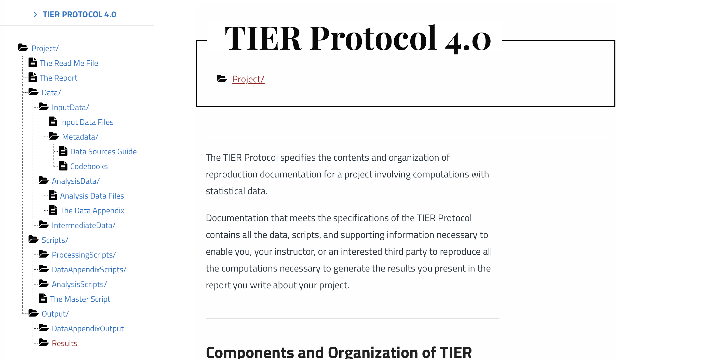

## Agenda

1. What is expected from you as an author nowadays?
1. [10 simple rules to Reproducibility](https://zenodo.org/records/8117361) compiled by the Econ Data Editors.
2. The `README` file.
3. Some Reproducibility Best Practices.
4. Let's start a reproducible research project!

# What Is Required From Authors? 🫵 {background-color="#40666e"}


## What is Required from Authors?

* Most (all?) journals require authors to share code and data.
* Only 19 (!) journals endorse the [Data and Code Availability Standard](https://datacodestandard.org) and enforce it via a Data Editor.

::: {.fragment}

:::{.callout-warning}

# What Do We Expect

_An advanced graduate student should be able to generate_

1. All Figures
2. All Tables
3. All in-text numbers

_with your package in the most user-friendly way possible_. 

:::
:::

:::{.fragment}
A priori, our output should be **exactly equal** to yours. 😬
:::
---

## [10 simple rules](https://zenodo.org/records/8117361) to Reproducibility

:::: {.columns}

::: {.column width="45%"}
::: {.incremental}
(@) Computational Empathy
(@) Make data accessible
(@) Cite Data and how to access it
(@) Describe software and hardware requirements
(@) Provide all code
:::

:::
::: {.column width="2%"}
<!-- empty column to create gap -->
:::
::: {.column width="43%"}
::: {.incremental}
(@) Explain how to reproduce your work
(@) Provide a table of all things that can be reproduced
(@) Include all supporting material
(@) Use a permissible license. Any [license](https://blog.codinghorror.com/pick-a-license-any-license/) is better than none.
(@) Re-run everything!

:::

:::
::::

---

## The `README` File

1. Plain text top level file which explains [everything]{.bg style="--col: #e64173"} about your package.
2. We have a useful [template](https://social-science-data-editors.github.io/template_README/template-README.html) and a [template generator](https://www.templatereadme.org).
3. Here are the [minimum requirements for a `README`](https://jpedataeditor.github.io/package.html#sec-package-readme) at *JPE*


# Best Practices {background-color="#40666e"}

## Best Practices

1. Project Organisation (**folder structure**)
2. Code
3. Data
4. Output


## Best Practices


### Project Organisation

* _Folder Structure_ is a first order concern for your project.

::: {.fragment}

::: {.callout-tip}
# Minimum Requirement

There should be a separation along:

1. Inputs: Data, parameters, etc
2. Outputs: Numbers, tables, figures
3. Code
4. Paper/Report etc
:::
:::

::: {.fragment}
Example?
:::


## Best Practices

### Good or Bad?

::: {.columns}
::: {.column width=45%}

<br>
```
.
├── 20211107ext_2v1.do
├── 20220120ext_2v1.do
├── 20221101wave1.dta
├── james
│   └── NLSY97
│       └── nlsy97_v2.do
├── mary
│   └── NLSY97
│       └── nlsy97.do
├── matlab_fortran
│   ├── graphs
│   ├── sensitivity1
│   │   ├── data.xlsx
│   │   ├── good_version.do
│   │   └── script.m
│   └── sensitivity2
│       ├── models.f90
│       ├── models.mod
│       └── nrtype.f90
├── readme.do
├── scatter1.eps
├── scatter1_1.eps
├── scatter1_2.eps
├── ts.eps
├── wave1.dta
└── wave2.dta
└── wave2regs.dta
└── wave2regs2.dta
```
(scroll down! 😉)

:::
::: {.column width="1%"}
<!-- empty column to create gap -->
:::
::: {.column width=45%}

::: {.fragment}

<br>
<br>

#### Bad! 👎

* Sub directories are not helpful
* File names are confusing
* code/data/output are *not* separated

:::


:::
:::


## Best Practices

### Good 👍


::: {.columns}
::: {.column width=45%}

<br>
```
.
├── README.md
├── code
│   ├── R
│   │   ├── 0-install.R
│   │   ├── 1-main.R
│   │   ├── 2-figure2.R
│   │   └── 3-table2.R
│   ├── stata
│   │   ├── 1-main.do
│   │   ├── 2-read_raw.do
│   │   ├── 3-figure1.do
│   │   ├── 4-figure3.do
│   │   └── 5-table1.do
│   └── tex
│       ├── appendix.tex
│       └── main.tex
├── data
│   ├── processed
│   └── raw
└── output
    ├── plots
    └── tables
```


:::
::: {.column width="1%"}
<!-- empty column to create gap -->
:::
::: {.column width=45%}

<br>

::: {.fragment}
#### Good.

* Meaningful sub directories
* top level `README`
* code/data/output are separated


:::


:::
:::


## Best Practices


### Example: [TIER Protocol](https://www.projecttier.org/tier-protocol/protocol-4-0/) structure




## Best Practices

### Best Project Structure?

<br>


::: {.fragment}
::: {.callout-note}
There is no unique best way to organize your project: Make it simple, intuitive and helpful.
:::
:::

<br>

::: {.fragment}
::: {.callout-important}
Ideally your *entire* project is under [version control](https://git-scm.com/book/en/v2/Getting-Started-About-Version-Control). 
:::
:::

# Reproducible Code {background-color="#40666e"}


## Reproducible Code

::: {.callout-tip}
# Question:

How to write reproducible code? 
:::

::: {.fragment}
👉 Huge question to answer. Let's try with a few simple things first:
:::

::: {.fragment}
1. Provide a run script which...*runs everything*. Run it often!
2. [No]{.bg style="--col: #e64173"} copy and paste in your pipeline! Write results to computer's storage.
3. Clear instructions
4. Provide a clear way to create the required environment (library installation etc)
:::


## Reproducible Code


::: {.columns}
::: {.column width=45%}

::: {.callout-important}
# No Manual Manipulation.
* _Change this parameter to 0.4, then run code again_ 😖
* _I computed this number manually_ 😖😖
:::

::: {.callout-tip}
# Do This!
* Use functions, ado files, programs, macros, subroutines etc
* Use loops and parameters
* Use placeholders for file paths
:::

:::
::: {.column width="1%"}
<!-- empty column to create gap -->
:::
::: {.column width=45%}

In general, take all necessary steps to ensure cross-platform compatibility of your code.

::: {.fragment}
_file paths are such low-hanging fruit 🍇..._
:::

::: {.fragment}
_don't build tables by hand_
:::

:::
:::


## Reproducible Code

### File Paths

👉 Ask the user to set the `root` of your project, via global variable, environment variable, or other
```R
# in my R, I do
Sys.setenv(PACKAGE_ROOT="/Users/floswald/Downloads/your_package")

# your package uses:
file.path(Sys.getenv("PACKAGE_ROOT"), "data", "wages.csv")
```

```stata
# in my stata, I do
global PACKAGE_ROOT "/Users/floswald/Downloads/your_package"

# your package uses
use "$PACKAGE_ROOT/data/wages.dta"
```

[Always]{.bg style="--col: #e64173"} use forward slashes on Stata `/`, even on a windows machine!

## Reproducible Code 

### Tables


:::: {.columns}

::: {.column width=45%}


#### R

* [https://modelsummary.com](https://modelsummary.com)
* [qt + quarto](https://jeremydata.quarto.pub/gt-quarto-demo/#/lets-build-a-gt-table)
* All packages [here](https://modelsummary.com/vignettes/appearance.html)


#### julia

* [RegressionTables.jl](https://github.com/jmboehm/RegressionTables.jl)
* [LaTeXTabulars.jl](https://github.com/tpapp/LaTeXTabulars.jl)


:::


::: {.column width=1%}
:::

::: {.column width=45%}

#### stata

* [outreg2](https://www.princeton.edu/~otorres/Outreg2.pdf)
* etc


#### In General

A little [mustache](https://mustache.github.io) templating goes a long way...

```python
insert {{ x }} here
```


:::


::::


## Reproducible Code

### Safe Environments for Running Your Code

:::: {.columns}

::: {.column width=45%}
](https://imgs.xkcd.com/comics/python_environment.png)
:::


::: {.column width=1%}
:::

::: {.column width=45%}
::: {.fragment}
::: {.callout-important}
# No Guarantee

Your code will yield identical results on a different computer **only if** certain conditions apply.
:::
:::

::: {.fragment}
::: {.callout-tip}
# Protected Environments 

👉 You should provide a mechanism which ensures that those conditions *do* apply.

:::
:::

:::


::::

# Reproducible Code 💻 <br/> Is Our Daily Bread 🍞 {background-color="#40666e"}


## 🧪 Reproducibility: Bread Baking vs. Code Execution  


::: {style="font-size: 70%;"}

| 🍞 **Baking Bread (Chemical Experiment)**         | 💻 **Running a Script (Computational Experiment)**        |
|--------------------------------------------------|------------------------------------------------------------|
| **Ingredients**                                  | **Dependencies**                                           |
| - 500g flour                                     | - Python 3.10                                              |
| - 300ml water                                    | - `numpy==1.24.0`                                          |
| - 7g dry yeast                                   | - `pandas==1.5.3`                                          |
| - 10g salt                                       | - `scikit-learn` *(no version specified)*                  |


:::

## 🧪 Reproducibility: Bread Baking vs. Code Execution  


::: {style="font-size: 70%;"}

| 🍞 **Baking Bread (Chemical Experiment)**         | 💻 **Running a Script (Computational Experiment)**         |
|--------------------------------------------------|------------------------------------------------------------|
| **Ingredients**                                  | **Dependencies**                                           |
| - 500g flour                                     | - Python 3.10                                              |
| - 300ml water                                    | - `numpy==1.24.0`                                          |
| - 7g dry yeast                                   | - `pandas==1.5.3`                                          |
| - 10g salt                                       | - `scikit-learn` *(no version specified)*                 |
| **Instructions**                                 | **Instructions**                                           |
| 1. Mix ingredients                               | 1. Clone the repository from GitHub                        |
| 2. Knead dough                                   | 2. Create and activate a virtual environment               |
| 3. Let rise 1 hour at room temperature           | 3. Install dependencies from `requirements.txt`            |
| 4. Bake at 220°C for 30 minutes                  | 4. Run `python train_model.py` with default config         |


:::

## 🧪 Reproducibility: Bread Baking vs. Code Execution  


::: {style="font-size: 70%;"}

| 🍞 **Baking Bread (Chemical Experiment)**         | 💻 **Running a Script (Computational Experiment)**         |
|--------------------------------------------------|------------------------------------------------------------|
| **Ingredients**                                  | **Dependencies**                                           |
| - 500g flour                                     | - Python 3.10                                              |
| - 300ml water                                    | - `numpy==1.24.0`                                          |
| - 7g dry yeast                                   | - `pandas==1.5.3`                                          |
| - 10g salt                                       | - `scikit-learn` *(no version specified)*                 |
| **Instructions**                                 | **Instructions**                                           |
| 1. Mix ingredients                               | 1. Clone the repository from GitHub                        |
| 2. Knead dough                                   | 2. Create and activate a virtual environment               |
| 3. Let rise 1 hour at room temperature           | 3. Install dependencies from `requirements.txt`            |
| 4. Bake at 220°C for 30 minutes                  | 4. Run `python train_model.py` with default config         |
| **Expected Outcome**                             | **Expected Outcome**                                       |
| - Well-risen, airy loaf of bread                 | - Consistent training accuracy and saved model             |

:::

## ⚠️ What Could Possibly Go Wrong?  

::: {style="font-size: 70%;"}


| 🍞 **Bread Baking (Chemical Experiment)**               | 💻 **Running a Script (Computational Experiment)**               |
|---------------------------------------------------------|------------------------------------------------------------------|
| **1. Yeast Inactivation**                               | **1. Library Version Mismatch**                                 |
| Water too hot (e.g., 60°C) kills the yeast. No rise.    | `scikit-learn` was updated → `train_test_split()` behaves differently, causing changes in results. |

:::

## ⚠️ What Could Possibly Go Wrong?  

::: {style="font-size: 70%;"}


| 🍞 **Bread Baking (Chemical Experiment)**               | 💻 **Running a Script (Computational Experiment)**               |
|---------------------------------------------------------|------------------------------------------------------------------|
| **1. Yeast Inactivation**                               | **1. Library Version Mismatch**                                 |
| Water too hot (e.g., 60°C) kills the yeast. No rise.    | `scikit-learn` was updated → `train_test_split()` behaves differently, causing changes in results. |
| **2. Cold Proofing**                                    | **2. Different OS / File System**                               |
| Room too cold (e.g., 15°C) → dough rises too slowly.    | Path handling fails on Windows vs. Linux (`\` vs. `/`), or line endings cause script errors. |

:::
## ⚠️ What Could Possibly Go Wrong?  

::: {style="font-size: 70%;"}


| 🍞 **Bread Baking (Chemical Experiment)**               | 💻 **Running a Script (Computational Experiment)**               |
|---------------------------------------------------------|------------------------------------------------------------------|
| **1. Yeast Inactivation**                               | **1. Library Version Mismatch**                                 |
| Water too hot (e.g., 60°C) kills the yeast. No rise.    | `scikit-learn` was updated → `train_test_split()` behaves differently, causing changes in results. |
| **2. Cold Proofing**                                    | **2. Different OS / File System**                               |
| Room too cold (e.g., 15°C) → dough rises too slowly.    | Path handling fails on Windows vs. Linux (`\` vs. `/`), or line endings cause script errors. |
| **3. High Altitude Baking**                             | **3. Hardware Differences (e.g., CPU vs. GPU)**                 |
| Lower pressure expands gas too fast; loaf collapses.    | Numerical precision differs → inconsistent model outputs.        |

:::
## ⚠️ What Could Possibly Go Wrong?  

::: {style="font-size: 70%;"}


| 🍞 **Bread Baking (Chemical Experiment)**               | 💻 **Running a Script (Computational Experiment)**               |
|---------------------------------------------------------|------------------------------------------------------------------|
| **1. Yeast Inactivation**                               | **1. Library Version Mismatch**                                 |
| Water too hot (e.g., 60°C) kills the yeast. No rise.    | `scikit-learn` was updated → `train_test_split()` behaves differently, causing changes in results. |
| **2. Cold Proofing**                                    | **2. Different OS / File System**                               |
| Room too cold (e.g., 15°C) → dough rises too slowly.    | Path handling fails on Windows vs. Linux (`\` vs. `/`), or line endings cause script errors. |
| **3. High Altitude Baking**                             | **3. Hardware Differences (e.g., CPU vs. GPU)**                 |
| Lower pressure expands gas too fast; loaf collapses.    | Numerical precision differs → inconsistent model outputs.        |
| **4. Too Much Salt**                                    | **4. Missing or Incorrect Environment Variable**               |
| Excess salt suppresses yeast → poor fermentation.       | `DATA_DIR` not set → script fails or loads wrong input silently. |
| **Result: Flat, dense, or failed bread**                | **Result: Different outputs, errors, or failed experiments**     |

:::

## Reproducible Code

### Safe Environments for Running Your Code

* At a minimum, your `README` lists the exact computing environment:
* OS, software and which version used (`R 4.1`, `stata 17/MP`, `matlab 2023b`, `GNU Fortran (Homebrew GCC 13.2.0)`)

* Libraries and which exact version used (`ggplot2 1.3.4`, `outreg 2`, `numpy 1.26.4`, `boost 1.8.3` )

* Stata: install all libraries [into]{.bg style="--col: #e64173"} your replication package.

👉 Virtual Environments can help.


## Reproducible Code

### Provide a Virtual Environment


:::: {.columns}

::: {.column width=45%}

`python` via anaconda:
```python
conda create -n py27 python=2.7 numpy=1.15.4 matplotlib
conda activate py27
```
There are other virtual env managers in python


`R` via [`renv`](https://rstudio.github.io/renv/articles/renv.html)

```R
# in your existing project:
renv::init() # creates local library
renv::snapshot() # commit
renv::restore()  # checkout
```


:::


::: {.column width=1%}
:::

::: {.column width=45%}

`julia` built-in `Pkg` manager:

```julia
(@v1.10) pkg> activate .
  Activating new project at `~/my-project`
  
(my-project) pkg> add DataFrames GLM
# created 2 files in `~/my-project`
# tracking all dependencies

```


`Docker` 🐳 [container](https://aeadataeditor.github.io/posts/2021-11-16-docker). This provides a fully specified virtual machine (i.e. a dedicated computer for your project)


:::


::::

## Reproducible Code

### Stata Virtual Environment

1. Include a `version xyz` statement in master script. 
2. User contributed libraries are not versioned.
3. You *must* install all libraries next to your project code. If not, `ssc install somelib` will install an incompatible version a few years later.
4. Here is  a [_config.do script](https://github.com/reifjulian/my-project/blob/master/analysis/scripts/programs/_config.do) forcing stata to use only libraries installed in a given location.
5. Excellent guidance by [Julian Reif](https://julianreif.com/guide/#libraries)
6. We will do this later on!


## Reproducible code

::: {.callout-note}
Such mechanisms can reduce version conflicts amongst your dependencies. To the extent that all versions of those dependencies are still available, this guarantees a stable computing environment.
:::


# Data  {background-color="#40666e"}

## Data

* Always keep your raw data intact (i.e. read-only). 
* Generate separate analysis datasets to perform analysis. 
* Datasets change over time, keep a record of the date and versions you obtained. It might be difficult to obtain it in the future.


### What about Confidential Data?

::: {.incremental}
1. If we have instructions for direct access, we try (time limit: 30 mins)
2. If not, try to get access to authors/data provider's machine (i.e. their _screen_)
3. If not, data provider may certify results for us.
4. If not, must provide simulated version of data.
:::

# Output  {background-color="#40666e"}

## Output


* Write both tables and figures to local storage (don't just display on the console!)
* The gold standard: include this table in your readme.

:::{.smaller}

| Output in Paper | Output in Package | Program to execute |
| ------ | -------- | ------------------------- |
| Table 1 | `outputs/tables/table1.tex` |  `code/table1.do` |
| Figure 1 | `outputs/plots/figure1.pdf` |  `code/figure1.do` |
| Figure 2 | `outputs/plots/figure2.pdf` |  `code/figure2.do` |

:::

## Output

* keep a full pipeline intact at all times: `run_all()`
* have a dedicated output folder *which you delete frequently*
* version output: during revisions, create separate locations for output, `rev1`, `rev2` etc, so you know exactly what version of code made which output.


# Break ☕️ 🍰 {background-color="#40666e"}


# Hands On Session 💪🏽 {background-color="#40666e"}

10 Steps till Reproducibility


## Step 1: Project Setup and Data Acquisition

* Create a folder structure: `data`, `code`, `output`, `paper`
* Create `README.md` at root of this structure
    
* download example data [from zenodo](https://zenodo.org/records/15124721)
    * save data citation
    * copy data into `data/raw`
    * set data to read only
  
## Step 2: Stata Setup

* Create folder `code/stata`
* Create a `run.do` file
* Set up a `config.do` as well.

Here is an outline of a potential `run.do` file:

```
run.do
    - set global variables: paths, full/partial data etc
    - call config.do
        - tell stata where to look for add-ons
    - run analysis
```
* Stata does _not_ crash upon error in nested do-file: must look at `log`s.

## Step 3: Stata Analysis Code

* Always operate full pipeline via `run.do` (can abbreviate)
* read, transform, store data
* do analysis proper
* _Never_ build a table by hand!

## Step 4: Document Output in `README`

* Add used software packages to readme
* Add OS and stata version to readme
* Create table in readme indicating where which piece of output can be found

## Step 5: Write a Paper!

* Paper should reference objects in `/output/`
* Delete `/output/` and try to recompile: error. Good!
* Regenerate `/output/`
* Add total runtime to readme.

## Step 6: Add `R` Code

* Create `/code/R/` 
* Add `R` script

## Step 7: Incorporate R output in Paper

* Paper should reference objects in `/output/`
* Recompile paper


## Step 8: Record R package environment

* How to make sure we freeze the R package environment?
* What about upstream dependencies? 
* add `renv` to `/code/R/` folder.
* Re-run.

## Step 9: Add R package citations

* Cite the software packages you used!
* Very easy with `R`.

## Step 10: Recompile Paper

and submit to a great journal like the JPE! 😉


# End 🍻 {background-color="#40666e"}
